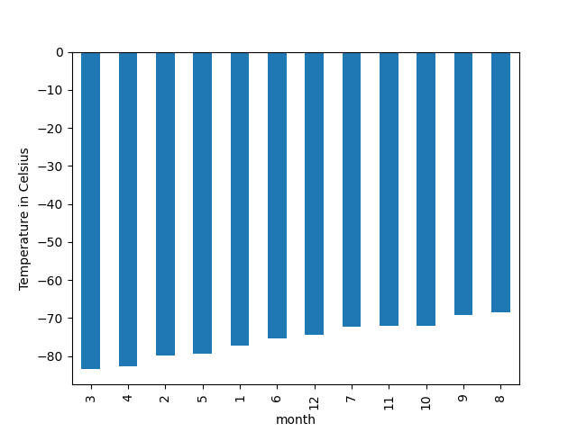
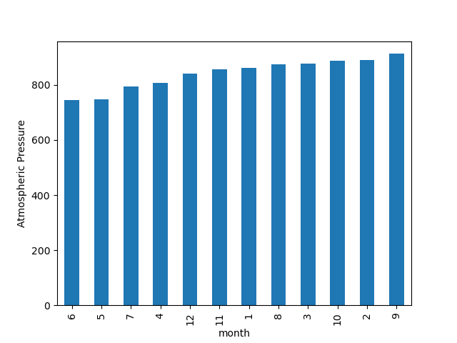
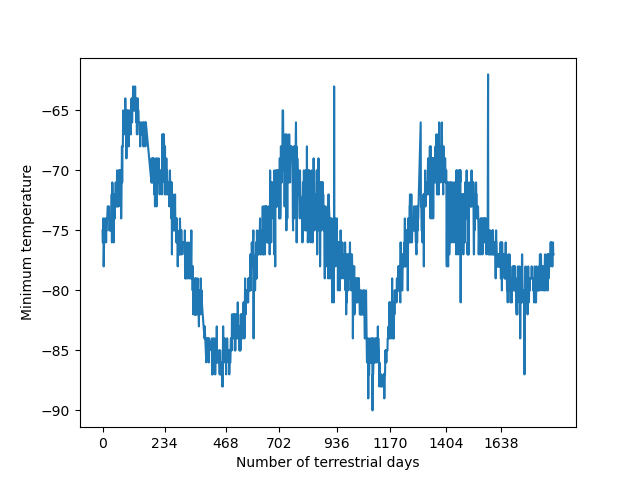

# data-collection-challenge

# Mars News and Mars Weather - Data Collection and Analysis

## Mars News

### Data Collection

* Mars news data from [Mars Website](https://static.bc-edx.com/data/web/mars_news/index.html) is scraped using [Splinter](https://splinter.readthedocs.io/en/latest/) and [BeautifulSoup](https://www.crummy.com/software/BeautifulSoup/).

### Analysis
* The title and preview of news data is saved to a [Pandas](https://pandas.pydata.org/) [DataFrame](https://pandas.pydata.org/docs/user_guide/dsintro.html#dataframe) and then saved to a csv file - [Mars News](./Mars/Output/mars_news.csv)

## Mars Weather

### Data Collection

* Mars weather data is scraped from [Mars Temperature Data Site](https://static.bc-edx.com/data/web/mars_facts/temperature.html) using [Splinter](https://splinter.readthedocs.io/en/latest/) and [BeautifulSoup](https://www.crummy.com/software/BeautifulSoup/).
* The data collected is saved to a [Pandas](https://pandas.pydata.org/) [DataFrame](https://pandas.pydata.org/docs/user_guide/dsintro.html#dataframe).

### Analysis

#### Questions
1. How many months exist on Mars?
   * 12
2. How many Martian (and not Earth) days worth of data exist in the scraped dataset?
   * 1867
3. What are the coldest and the warmest months on Mars (at the location of Curiosity)?
     
4. Which months have the lowest and the highest atmospheric pressure on Mars?
     
5. About how many terrestrial (Earth) days exist in a Martian year? 
   

## Files
* Source Code:
    1. Mars/part_1_mars_news.ipynb
    2. Mars/part_2_mars_weather.ipynb
* Datasets:
  [Mars Website](https://static.bc-edx.com/data/web/mars_news/index.html)
  [Mars Temperature Data Site](https://static.bc-edx.com/data/web/mars_facts/temperature.html)
* Output:
  1. Mars/Output/mars_news.csv - CSV files that contains data scraped from [Mars Website](https://static.bc-edx.com/data/web/mars_news/index.html)
  2. Mars/Output/mars_temparature.csv - CSV files that contains data scraped from [Mars Temperature Data Site](https://static.bc-edx.com/data/web/mars_facts/temperature.html)
  3. Mars/Output/average_temp_by_month.png
  4. Mars/Output/coldest_hottest_months.png
  5. Mars/Output/average_pressure_by_month.png
  6. Marts/Output/terrestrial_days.png
  
## Run Instructions
* Open a terminal
* Confirm condo version\
  conda --version
* Confirm jupyter version\
  jupyter --version
* Activate conda environment\
  conda activate dev
* Install chromeDriver\
  Win - Download and install from Selenium project\
  Mac - brew install chromedriver
* Install packages\
  pip install "splinter[selenium]"\
  pip install bs4\
  pip install html5lib\
  pip install lxml
* Launch Jupyter Notebook\
  jupyter notebook
* Jupyter Notebook is opened in a browser
* Open "Mars/part_1_mars_news.ipynb" file using Jupyter Notebook
* Click on 'Cell > Run All' to run
* Open "Mars/part_2_mars_weather.ipynb" file using Jupyter Notebook
* Click on 'Cell > Run All' to run

# Disclaimer
This repo was published for educational purpose only. Copyright 2024 edX Boot Camps LLC. All rights reserved.
